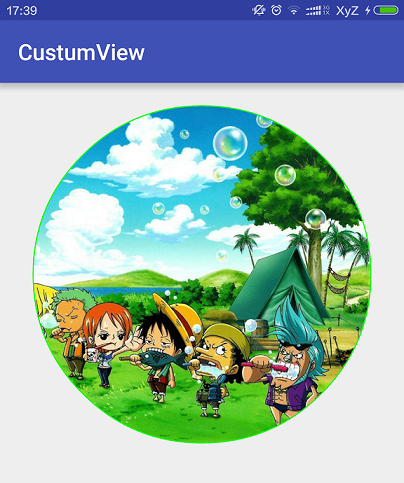

# CustumView
自定义View

## CircleImageView

把图片显示为圆形。



属性如下：

```
// 边框宽度
<attr name="border_width" format="dimension"/> 
// 边框颜色
<attr name="border_color" format="color"/>
// 图片资源
<attr name="src" format="reference"/>
// 半径（View的大小=radius+border_width/2）
<attr name="radius" format="dimension"/>
```
